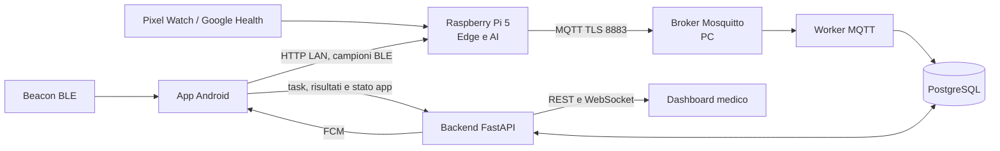

# Triage IoT

Sistema distribuito per il monitoraggio domiciliare e il supporto al triage.

Progetto realizzato da **Emilio Pascadopoli** e **Daniel Spedicato** per il corso
Internet of Things 2025/2026 dell'Universita del Salento.

> Il software e' un prototipo accademico. Gli indicatori prodotti non costituiscono
> una diagnosi e la valutazione finale resta al medico.

## Obiettivo

Triage IoT raccoglie dati fisiologici e di routine domestica, li elabora vicino al
paziente e presenta al medico un quadro temporale comprensibile. Il sistema unisce:

- dati Google Health acquisiti dal Pixel Watch;
- posizione indoor stimata con beacon BLE e app Android;
- finestre temporali Edge di quattro minuti;
- modelli di anomaly detection generici e personali;
- trasporto MQTT cifrato verso il backend;
- dashboard web per medico, app paziente e interfaccia caregiver;
- alert, task, questionari, messaggi, notifiche push e audit.

L'elaborazione Edge continua anche quando il PC non e' temporaneamente raggiungibile:
i messaggi MQTT non inviati vengono accodati sul Raspberry e ritentati al ritorno della
rete.

## Architettura



### Distribuzione reale

| Nodo | Responsabilita | Servizi principali |
| --- | --- | --- |
| Raspberry Pi 5 | Ricezione BLE, aggregazione, inferenza AI e pubblicazione | `iot-edge.service`, porta HTTP `8000` |
| PC | Broker, database, backend, worker e dashboard | MQTT TLS `8883`, PostgreSQL `5432`, API `8080`, web `5173` |
| Telefono Android | Scansione beacon, app paziente/caregiver, task e notifiche | Receiver `http://IP_RPI:8000`, API `http://IP_PC:8080/api/v1` |

PC, Raspberry e telefono devono essere sulla stessa rete locale. Il PC deve restare
acceso e non deve entrare in sospensione durante acquisizione e demo.

## Componenti

Il repository corrente e' il repository di integrazione:

- [repository integrato](https://github.com/emipasca12/ProgettoIoT)
- [Edge e gateway](edge_node/README.md)
- [Cloud, backend e broker](cloud/README.md)
- [Dashboard medico](Dashboard/README.md)
- [App Android paziente e caregiver](Applicazione%20IoT%20Companion/companion_Android_app/README.md)
- [Contratti API e MQTT](Documenti/contracts/README.md)
- [Test ufficiali](Test.md)

Le istruzioni del corso richiedono un repository GitHub per ogni componente. I nomi
scelti per la consegna sono:

| Componente | Repository dell'organizzazione |
| --- | --- |
| Edge e gateway | [wot-project-2025-2026-edge-Pascadopoli-Spedicato](https://github.com/UniSalento-IDALab-IoTCourse-2025-2026/wot-project-2025-2026-edge-Pascadopoli-Spedicato) |
| Cloud e backend | [wot-project-2025-2026-cloud-Pascadopoli-Spedicato](https://github.com/UniSalento-IDALab-IoTCourse-2025-2026/wot-project-2025-2026-cloud-Pascadopoli-Spedicato) |
| Dashboard web | [wot-project-2025-2026-dashboard-Pascadopoli-Spedicato](https://github.com/UniSalento-IDALab-IoTCourse-2025-2026/wot-project-2025-2026-dashboard-Pascadopoli-Spedicato) |
| App Android | [wot-project-2025-2026-android-Pascadopoli-Spedicato](https://github.com/UniSalento-IDALab-IoTCourse-2025-2026/wot-project-2025-2026-android-Pascadopoli-Spedicato) |
| Sito di presentazione | [wot-project-2025-2026-presentation-Pascadopoli-Spedicato](https://github.com/UniSalento-IDALab-IoTCourse-2025-2026/wot-project-2025-2026-presentation-Pascadopoli-Spedicato) |

Se un collegamento restituisce `404`, il repository corrispondente deve ancora essere
creato nell'organizzazione del corso. Non inserire nei repository componenti segreti o
dati raccolti.

### Materiale richiesto per l'esame

Secondo le istruzioni del corso devono essere consegnati:

- documentazione tecnica e codice GitHub entro una settimana dall'esame;
- presentazione entro il giorno precedente all'esame, oppure almeno tre giorni
  lavorativi prima se si desidera un feedback;
- una GitHub Page che presenti obiettivo, architettura, componenti e demo;
- un README in ogni repository componente con progetto generale, architettura, link
  agli altri repository e descrizione del componente specifico.

La GitHub Page ha funzione di vetrina; non sostituisce i repository dei componenti o la
documentazione tecnica.

## Funzioni realizzate

### Edge e AI

- ricezione dei campioni BLE inviati dall'app;
- acquisizione Google Health tramite OAuth;
- aggregazione in finestre di quattro minuti;
- controllo di qualita e gestione esplicita dei dati mancanti;
- modelli generici spaziale e wearable, modello personale e fusione degli score;
- score AI, confidenza, fattori esplicativi, trend e drift;
- coda MQTT locale con ritentativo;
- avvio automatico tramite `systemd`.

### Backend e comunicazione

- FastAPI, PostgreSQL e migrazioni Alembic;
- autenticazione per medico, paziente, caregiver e amministratore;
- associazione autorizzata tra account, `patient_id` e dispositivo;
- ingestione MQTT con TLS, API REST e aggiornamenti WebSocket;
- alert con presa in carico e risoluzione;
- attivita, questionari, risultati e messaggi personalizzati;
- notifiche Firebase distinte per paziente e caregiver;
- report, riepilogo 24 ore, timeline, routine ambientale e audit;
- retention, backup e endpoint di diagnostica.

### Interfacce

- dashboard clinica con grafici interattivi, andamento AI e stato tecnico;
- storico di finestre, alert, attivita e questionari;
- app Android con monitoraggio BLE in foreground e riavvio automatico;
- home paziente, task guidati, risultati offline e notifiche;
- vista caregiver limitata agli eventi autorizzati e pubblicabili;
- credenziali tecniche protette nelle impostazioni amministrative.

## Struttura del repository

```text
Applicazione IoT Companion/
  companion_Android_app/    App Android paziente e caregiver
  companion_iOS_app/        Prototipo iOS, non incluso nella demo ufficiale
cloud/
  backend/                  API FastAPI, worker, test e migrazioni
  mqtt/                     Mosquitto, ACL e certificati locali
  docker-compose.yml        Stack eseguito sul PC
Dashboard/                  Frontend React/Vite del medico
Documenti/contracts/        Contratti REST, WebSocket e MQTT
edge_node/                  Acquisizione, AI, receiver e deployment Edge
Script/avvio/               Avvio PC e strumenti operativi
Script/rpi/                 Installazione e diagnostica Raspberry
Test.md                     Checklist di collaudo
```

## Codice Git e configurazioni locali

PC e Raspberry eseguono componenti diversi, ma non richiedono due versioni del codice.
Il codice sorgente resta su Git; ogni macchina conserva localmente configurazioni,
credenziali e dati runtime esclusi da `.gitignore`.

| Su Git | Solo locale, mai su Git |
| --- | --- |
| sorgenti Python, React e Android | file `.env` reali |
| Docker Compose e Dockerfile | password Mosquitto e relativi backup |
| configurazioni `*.example` | certificati e chiavi private |
| template `systemd` | token OAuth Google/Fitbit |
| migrazioni e test | `google-services.json` e service account Firebase |
| contratti ed esempi anonimizzati | `edge.rpi.yml`, dati, output e modelli personali |

### Flusso quotidiano consigliato

Le modifiche si sviluppano e si pubblicano normalmente dal PC:

```powershell
git status --short
git add <file-modificati>
git diff --cached
git commit -m "Descrizione chiara della modifica"
git push origin main
```

Evitare `git add .` prima di aver controllato `git status`. Sul Raspberry si aggiornano
i sorgenti senza toccare la configurazione locale:

```bash
cd ~/progetto-iot
git pull --ff-only origin main
sudo systemctl restart iot-edge
bash Script/rpi/stato-rpi --network
```

Se una correzione viene fatta direttamente sul Raspberry, pubblicarla su un branch
dedicato e integrarla dal PC:

```bash
git switch -c rpi/correzione-descrittiva
git add edge_node/ Script/rpi/
git commit -m "Corregge acquisizione Edge"
git push -u origin rpi/correzione-descrittiva
```

Non usare branch permanenti `pc` e `rpi`: produrrebbero due copie divergenti dello
stesso progetto. La differenza tra le macchine e' nella configurazione ignorata da Git,
non nel ramo sorgente.

### Pubblicare i repository separati del corso

Mantenere questo repository come fonte unica. Nell'organizzazione del corso creare
prima i quattro repository componenti **vuoti**, senza README o commit iniziale. Poi,
una sola volta, registrare i remoti:

```powershell
git remote add course-edge https://github.com/UniSalento-IDALab-IoTCourse-2025-2026/wot-project-2025-2026-edge-Pascadopoli-Spedicato.git
git remote add course-cloud https://github.com/UniSalento-IDALab-IoTCourse-2025-2026/wot-project-2025-2026-cloud-Pascadopoli-Spedicato.git
git remote add course-dashboard https://github.com/UniSalento-IDALab-IoTCourse-2025-2026/wot-project-2025-2026-dashboard-Pascadopoli-Spedicato.git
git remote add course-android https://github.com/UniSalento-IDALab-IoTCourse-2025-2026/wot-project-2025-2026-android-Pascadopoli-Spedicato.git
```

Dopo aver committato e pubblicato `main` nel repository integrato, esportare ogni
cartella come radice del relativo repository:

```powershell
git subtree push --prefix=edge_node course-edge main
git subtree push --prefix=cloud course-cloud main
git subtree push --prefix=Dashboard course-dashboard main
git subtree push --prefix="Applicazione IoT Companion/companion_Android_app" course-android main
```

Ripetere gli stessi quattro `subtree push` dopo le modifiche future. Non modificare
direttamente i repository esportati: le correzioni vanno fatte qui, verificate e poi
ripubblicate. Il repository della GitHub Page va creato e gestito separatamente.

## Installazione e avvio

### Requisiti PC

- Windows 10/11 con PowerShell;
- Docker Desktop con Docker Compose;
- Git;
- Node.js 20 o successivo;
- Python 3.11 o successivo.

### Prima configurazione del PC

Clonare il repository e creare l'ambiente Python usato dagli strumenti Edge:

```powershell
git clone https://github.com/emipasca12/ProgettoIoT.git
cd ProgettoIoT
py -3.11 -m venv .venv
.\.venv\Scripts\python.exe -m pip install -r edge_node\requirements.txt
```

Creare i file locali partendo dagli esempi e sostituire tutti i placeholder:

```powershell
Copy-Item cloud\.env.example cloud\.env
Copy-Item cloud\backend\.env.example cloud\backend\.env
Copy-Item Dashboard\env.production.example Dashboard\.env
```

Nel file `Dashboard/.env`, per la demo locale, usare:

```dotenv
VITE_API_BASE_URL=http://127.0.0.1:8080/api/v1
VITE_WS_BASE_URL=ws://127.0.0.1:8080/ws/v1
VITE_DATA_SOURCE=real
```

Creare `cloud/mqtt/passwd` con `mosquitto_passwd` per gli utenti
`edge_patient_001`, `backend` e `mqtt_test`. Le password devono coincidere con quelle
in `cloud/.env`; non copiare mai il file password nel repository.

Generare il certificato per l'indirizzo LAN stabile del PC:

```powershell
.\Script\avvio\preparaCertificatiLAN.ps1 -PcHost 192.168.1.100
```

La prima volta, da PowerShell aperto come amministratore, autorizzare soltanto le porte
LAN necessarie:

```powershell
.\Script\avvio\abilitaFirewallLAN.ps1
```

Per abilitare le push, collocare localmente il service account in
`cloud/firebase/service-account.json`, inserire `google-services.json` nell'app Android
e attivare Firebase nel file `cloud/backend/.env`.

### Avvio del PC

Aprire Docker Desktop, attendere che il motore sia pronto e, dalla radice:

```powershell
.\Script\avvio\avviaPC.ps1
```

Lo script applica le migrazioni, avvia broker, database, backend e worker, costruisce la
dashboard e la espone su <http://127.0.0.1:5173>.

Negli avvii successivi, se il frontend non e' cambiato:

```powershell
.\Script\avvio\avviaPC.ps1 -SkipBuild
```

Per fermare PC e dashboard senza cancellare i volumi:

```powershell
.\Script\avvio\avviaPC.ps1 -Stop
```

Non avviare sul PC anche la pipeline Edge quando il Raspberry e' operativo.

### Prima configurazione del Raspberry Pi

Usare Raspberry Pi OS a 64 bit con Python 3.11 o successivo:

```bash
sudo apt update
sudo apt install -y git python3-venv python3-dev build-essential ca-certificates openssl
git clone https://github.com/emipasca12/ProgettoIoT.git ~/progetto-iot
cd ~/progetto-iot
```

Trasferire sul Pi, fuori da Git:

- il solo certificato pubblico `ca.crt` del broker;
- `google_health_client.json`;
- `google_health_token.json`.

Non trasferire `server.key`, gli `.env` del backend o il service account Firebase.
Proteggere i file OAuth con permessi `600`.

Con il servizio ancora fermo, eseguire il setup. Il comando chiede una volta la password
MQTT e installa il servizio automatico:

```bash
cd ~/progetto-iot
bash Script/rpi/setup-rpi \
  --pc-host 192.168.1.100 \
  --ca-file "$HOME/progetto-iot/edge_node/config/certs/ca.crt"
```

Dopo il setup, `iot-edge.service` parte a ogni accensione senza richiedere password.
La password MQTT e' salvata localmente in un file protetto e ignorato da Git.

### Controllo via SSH

```bash
ssh utente@IP_RPI
cd ~/progetto-iot
bash Script/rpi/stato-rpi --network
sudo journalctl -u iot-edge -f
```

Comandi utili:

```bash
sudo systemctl status iot-edge --no-pager
sudo systemctl restart iot-edge
sudo systemctl stop iot-edge
```

### Configurazione Android

Nelle impostazioni amministrative dell'app configurare:

```text
Receiver Raspberry: http://IP_RPI:8000/ble/sample
Backend clinico:    http://IP_PC:8080/api/v1
```

La demo usa due beacon validati: **Cucina** e **Bagno**. La Camera da letto non e'
monitorata e non deve essere interpretata come assenza del paziente.

Per generare l'APK debug:

```powershell
cd "Applicazione IoT Companion\companion_Android_app"
.\gradlew.bat clean assembleDebug
```

APK prodotto:

```text
app/build/outputs/apk/debug/app-debug.apk
```

## Verifica

Prima della demo attendere almeno un ciclo Edge completo, circa quattro o cinque
minuti, quindi verificare che dashboard e database mostrino timestamp nuovi.

Test Edge:

```powershell
.\.venv\Scripts\python.exe -m pytest edge_node\tests -q
```

Test backend:

```powershell
cd cloud\backend
.\.venv\Scripts\python.exe -m pytest -q
```

Test e build dashboard:

```powershell
cd Dashboard
npm ci
npm test
npm run build
```

Test Android:

```powershell
cd "Applicazione IoT Companion\companion_Android_app"
.\gradlew.bat test assembleDebug
```

Il collaudo manuale completo e' descritto in [Test.md](Test.md).

## Pulizia dati e modello provvisorio di `patient-001`

Questa procedura serve prima di una nuova raccolta dimostrativa. Non elimina account,
associazioni medico/paziente/caregiver, registrazioni dei dispositivi, token FCM o
template dei questionari.

Il reset Edge archivia i file invece di distruggerli. La pulizia del database crea
prima un dump PostgreSQL in `cloud/backups/`. Nessuno dei comandi seguenti viene
eseguito automaticamente.

### 1. Controllare senza modificare

Sul Raspberry:

```bash
cd ~/progetto-iot
bash Script/rpi/modello-paziente status
```

Sul PC, con lo stack avviato:

```powershell
.\Script\manutenzione\pulisciDatiPaziente.ps1 -PatientId patient-001
```

Il comando PC e' un `dry-run`: mostra quanti record verrebbero rimossi.

### 2. Fermare e archiviare il Raspberry

```bash
sudo systemctl stop iot-edge
cd ~/progetto-iot
git pull --ff-only origin main
bash Script/rpi/modello-paziente reset patient-001
```

Il comando sposta baseline, dati raw, stato, output, modello personale e coda MQTT in
`edge_node/data/archive/patient-001/<timestamp>/`. I modelli generici, OAuth,
configurazione e certificati non vengono toccati. Non riavviare ancora il servizio.

### 3. Pulire il database PC

```powershell
.\Script\manutenzione\pulisciDatiPaziente.ps1 `
  -PatientId patient-001 `
  -Execute `
  -ConfirmPatientId patient-001
```

Per impostazione predefinita l'audit viene conservato. Solo per una demo completamente
vuota si puo aggiungere `-IncludeAudit`; non e' consigliato per l'uso ordinario.

### 4. Avviare la nuova raccolta

Sul Raspberry:

```bash
sudo systemctl start iot-edge
bash Script/rpi/stato-rpi --network
```

Ogni finestra richiede quattro minuti. Un modello provvisorio richiede comunque almeno
50 finestre reali valide, quindi almeno 3 ore e 20 minuti senza finestre scartate. Lo
stato si controlla con:

```bash
bash Script/rpi/modello-paziente status
```

### 5. Addestrare il modello provvisorio

Quando `baseline_rows` e' almeno `50`:

```bash
sudo systemctl stop iot-edge
bash Script/rpi/modello-paziente train-provisional patient-001
sudo systemctl start iot-edge
bash Script/rpi/modello-paziente status
```

Il modello viene salvato come `models/patient-001.pkl` con origine
`patient_baseline_provisional`. Non viene inserito in Git. Per il modello definitivo si
deve ripetere il reset, raccogliere la baseline reale completa di sette giorni e
raggiungere almeno 1000 finestre valide. Il runtime esegue automaticamente il training
definitivo quando tali condizioni sono soddisfatte.

## Sequenza della demo

1. Avviare lo stack sul PC e verificare `/ready`.
2. Accendere il Raspberry e controllare `iot-edge.service` via SSH.
3. Accedere dall'app come paziente e mostrare monitoraggio e beacon.
4. Attendere o mostrare una finestra Edge gia acquisita.
5. Aprire la dashboard e illustrare score AI, confidenza e timeline.
6. Creare un'attivita e completarla dall'app paziente.
7. Inviare un messaggio caregiver e mostrare la separazione dei destinatari.
8. Mostrare stato sistema, report e audit.

Piano di riserva: usare dati gia presenti nel backend; se FCM non e' disponibile,
mostrare task e messaggi sincronizzati dentro l'app; se i beacon non trasmettono,
mostrare lo stato tecnico senza inventare dati.

## Sicurezza e limiti

- MQTT usa TLS, ACL e credenziali distinte per Edge e backend.
- API e WebSocket verificano ruolo e associazione al paziente.
- Token mobili sono conservati tramite Android Keystore.
- I segreti non vengono registrati nei log e non devono entrare in Git.
- Il receiver BLE opera nella LAN ed e' destinato al prototipo controllato.
- I modelli non sono stati validati come dispositivo medico.
- Il sistema dimostrativo dipende dalla disponibilita del PC nella rete locale.
- L'app iOS e' un prototipo e non fa parte della demo ufficiale.

## Licenza e dati

Il repository e' destinato all'attivita didattica del corso. Dataset, credenziali e dati
personali non sono distribuiti. Qualsiasi dato usato durante la demo deve essere
anonimizzato o riferito a un profilo dimostrativo.
